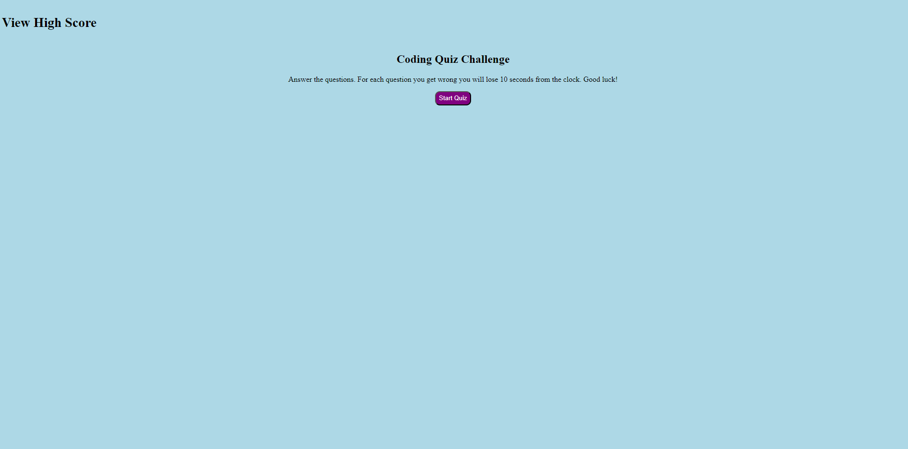

# mini-quiz

## Description

a short quiz application that has a time limit to answer questions. Reduces the total time for each question answered wrong. Able to record and delete high scores.

## Installation

N/A

## Usage

load up the website and click on the "Start Quiz" button to start the game. Then you will have 60 seconds to answer all the questions and lose 10 seconds for each question you get wrong. Add your initials to the high score table.

Preview: 

website:

https://salgonzalez151.github.io/mini-quiz/

## License

N/A